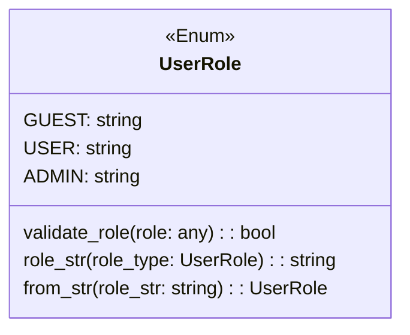
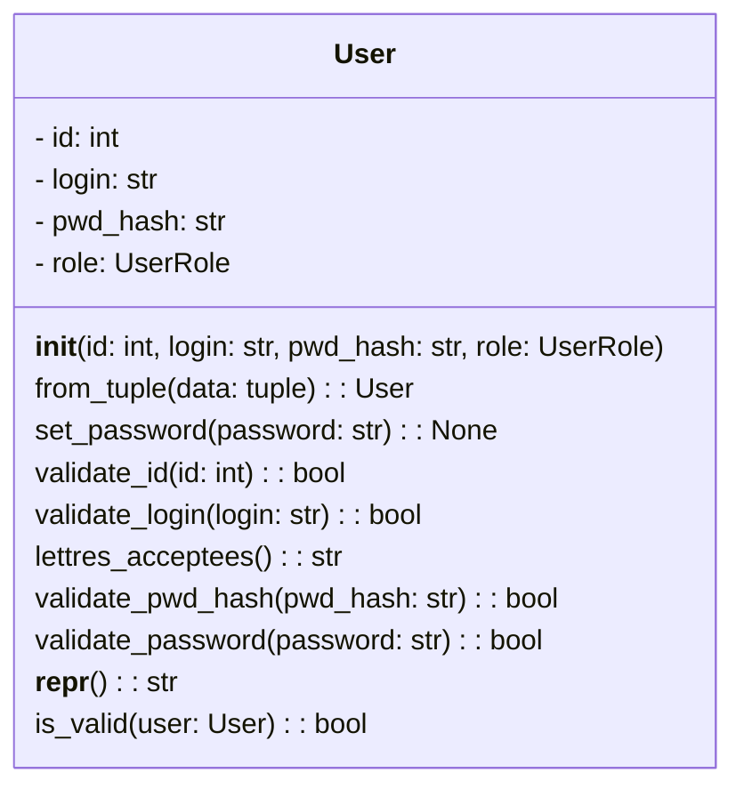
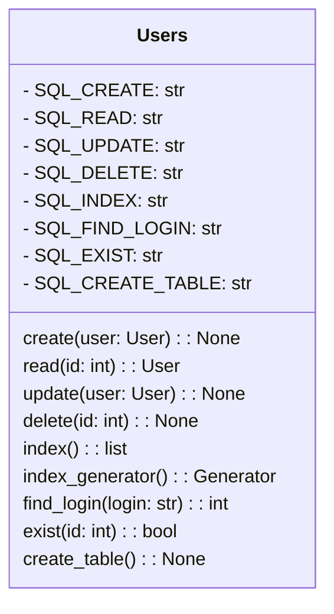
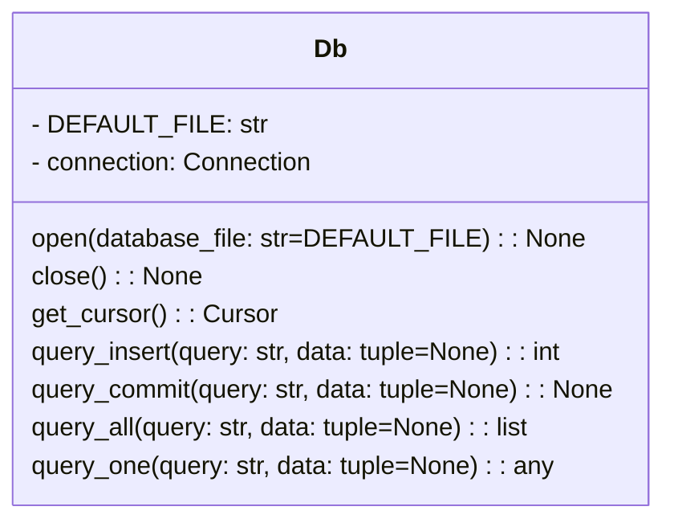

# Diagrammes de classes

## Classe UserRole

```mermaid
classDiagram
    class UserRole {
        <<Enum>>
        GUEST: string
        USER: string
        ADMIN: string
        validate_role(role: any): bool
        role_str(role_type: UserRole): string
        from_str(role_str: string): UserRole
    }
```

## Classe User

```mermaid
classDiagram
    class User {
        - id: int
        - login: str
        - pwd_hash: str
        - role: UserRole
        __init__(id: int, login: str, pwd_hash: str, role: UserRole)
        from_tuple(data: tuple): User
        set_password(password: str): None
        validate_id(id: int): bool
        validate_login(login: str): bool
        lettres_acceptees(): str
        validate_pwd_hash(pwd_hash: str): bool
        validate_password(password: str): bool
        __repr__(): str
        is_valid(user: User): bool
    }

```

## Classe Users

```mermaid
classDiagram
    class Users {
        - SQL_CREATE: str
        - SQL_READ: str
        - SQL_UPDATE: str
        - SQL_DELETE: str
        - SQL_INDEX: str
        - SQL_FIND_LOGIN: str
        - SQL_EXIST: str
        - SQL_CREATE_TABLE: str
        create(user: User): None
        read(id: int): User
        update(user: User): None
        delete(id: int): None
        index(): list
        index_generator(): Generator
        find_login(login: str): int
        exist(id: int): bool
        create_table(): None
    }

```

## Classe Db

```mermaid
classDiagram
    class Db {
        - DEFAULT_FILE: str
        - connection: Connection
        open(database_file: str=DEFAULT_FILE): None
        close(): None
        get_cursor(): Cursor
        query_insert(query: str, data: tuple=None): int
        query_commit(query: str, data: tuple=None): None
        query_all(query: str, data: tuple=None): list
        query_one(query: str, data: tuple=None): any
    }

```